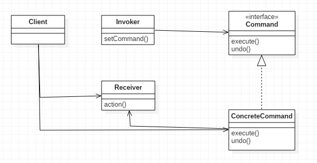

# Command 패턴의 정의

- 커맨드 패턴을 이용하면 요구 사항을 객체로 캡슐화 가능하다.
- 매개 변수를 써서 여러 가지 다른 요구 사항을 집어넣을 수 있다.
- 요청 내역을 큐에 저장하거나 로그로 기록할 수 있으며, 작업 취소 기능도 지원한다.

> Meta Command 패턴?
>
> > 메타 커맨드 패턴은 명령들로 이루어진 매크로를 만들어서 여러 개의 명령을 한 번에 실행 가능 하다.

# 다이어그램

# 커맨드 패턴 활용법

커맨드를 이용하면 컴퓨테이션의 한 부분을 패키지로 묶어서 일급 객체 형태로 전달하는 것도 가능하다.  
말이 좀 어렵지만, 책에서는 Thread Pool을 이용해 설명하고 있다. 작업큐는 execute 커맨드를 이용해 큐에 넣는 곳과 빼는곳이 있는데 빼는곳에서는 여러개의 스레드가 기다리고 있다가, 순서대로 작업을 처리한다. 하지만 스레드는 작업의 내용을 알고 처리하진 않는다.

이용법들

- Command 인터페이스에 logging 메소드를 추가해 로그를 기록하게 한다.
- store 메소드를 추가해 특정 작업까지 수행했다는 체크 포인트를 만들고, 종료 후 다시 시작할때 체크 포인트 부터 시작하게 구현 할 수 있다.

# 업무 적용?

업무에 사용되는 Java 기반 Client 프로그램은 작업의 과정은 똑같지만, 작업 내용은 세세하게 달라지는 부분이 있다. 커맨드 패턴을 공부하면서 해당 부분이 번뜩 떠올랐으며, 작업 처리 프로세스와 작업 종류를 분리해 작업 종류의 확장성과 의존성 분리의 이점을 가져올 수 있을 것 같다는 생각이 들었다. Invoker와 Receiver를 분리 시키는 Command 패턴 처럼 말이다.

# Reference

> - 
> - 
