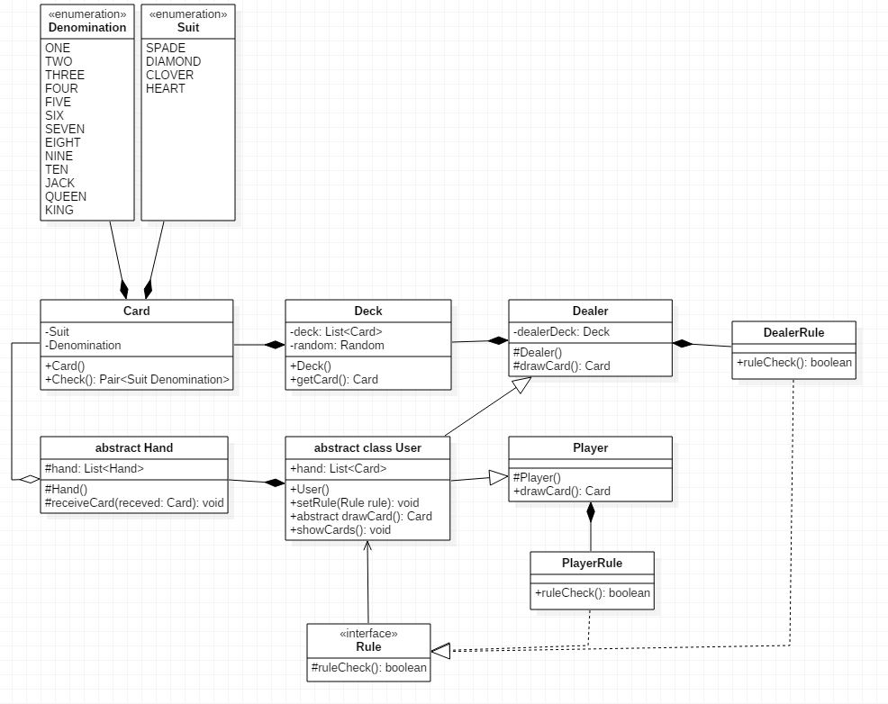
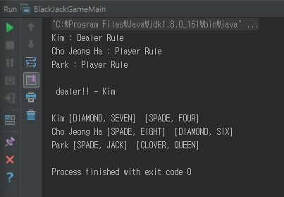

# 객체 지향 설계 연습하기 - 블랙잭 (9)

[github source code](https://github.com/JungHa-Cho/BlackJack)

# 들어가며

- 업무에 Java를 사용하고 있지만, 깊은 이해도가 부족하다는걸 절감.
- 단순 객체 생성 및 비즈니스 로직 구현에만 매달리고 있음. 회의감이 듦.
- 신규 개발 뿐만 아니라 유지 보수 및 리팩토링시 객체 지향의 묘미를 살려보고자 함
- 객체 지향적 시야와 사고는 연습뿐이라는 것을 여러 커뮤니티에서 수집
- 객체 지향 설계 연습을 통해 객체 지향적 시야와 이해력을 높이고지 함

# UML 5번째 버전입니다.

- 각각의 룰이 따로 적용될 수 있게 룰을 두개로 뜯고, 다형성을 이용한 STRATEGY 패턴을 적용해 보기로 했습니다.
- 물론, 스트래이트지 패턴이 확장 가능한 부분을 캡슐화하고 확장성을 증가 시켜주지만 여기서는 연습겸 적용시켜봤습니다.

# 소스코드

## 카드 이넘 관련

- Card, Suit, Denomination은 큰 변화가 없습니다.

## Rule과 User의 다형성

- STRATEGY 패턴을 적용해 봤습니다.

`gist:ppzxc/789afa23997044db818293fca45c1759#Rule.java`
`gist:ppzxc/789afa23997044db818293fca45c1759#DealerRule.java`
`gist:ppzxc/789afa23997044db818293fca45c1759#PlayerRule.java`

- Rule 인터페이스를 구현하는 DealerRule.java, PlayerRule.java를 만들어 룰 알고리즘 군을 생성했습니다.

`gist:ppzxc/789afa23997044db818293fca45c1759#User.java`

- User 추상 클래스는 이 Rule 인터페이스를 멤버 변수로 가지고 있으면서, Player와 Dealer가 각각 자기의 알고리즘군인 DealerRule, PlayerRule을 생성해 구현하죠.

`gist:ppzxc/789afa23997044db818293fca45c1759#Player.java`
`gist:ppzxc/789afa23997044db818293fca45c1759#Dealer.java`

- 이렇게 짜여잔 구조는 Main 클래스에서 이렇게 사용합니다.

`gist:ppzxc/789afa23997044db818293fca45c1759#BlackJackGameMain.java`

- 각각 Dealer와 Player는 User 변수로 합쳐져 GameBoard로 전달 됩니다.
- GameBoard를 볼까요?

`gist:ppzxc/789afa23997044db818293fca45c1759#GameBoard.java`

- GameBoard에서는 딜러와 유저의 구분 없이 모든 유저를 수용하고, GameStart에서 이를 사용합니다.
- `이렇게 구성하게 되면, DealerRule, PlayerRule 외에 어떠한 룰이 추가되더라도 기존 로직에는 변경없이 사용 가능한 STRATEGY 패턴입니다.`

> 여기서 `문제`가 발생했습니다.
> 다형성을 이용해 구분 없이 각자가 적용될 Rule을 들고 있는것 까진 좋은데, User에서 Dealer를 구분할 수가 없습니다.
> BlackJack에서 카드덱은 Dealer만 가지고 있으니까요. 유저는 딜러에게 카드를 요청해야 하니까요...
> 이 `문제`는 다음에 해결 하기로 했습니다...

- 나머지 Hand.java와 Deck.java 입니다.

`gist:ppzxc/789afa23997044db818293fca45c1759#Deck.java`
`gist:ppzxc/789afa23997044db818293fca45c1759#Hand.java`

- 실행 화면을 볼까요?
  

- 처음 세줄은 각각의 유저에게 적용되는 룰이 보여집니다.
- 딜러를 찾았네요.. 여기가 향후 해결해야될 `문제`입니다...
- 딜러에게 카드를 요청한 후 각자 핸드에 있는 두장의 카드를 표시해 줍니다.

# 끝으로

> 진도를 많이 빼면서 여기 저기 손보고 수정된 곳이 많은데, 지금 같이 진행하고 있는 `헤드퍼스트디자인패턴`에 나오는 디자인 원칙이 하나도 지켜지지 않았습니다.
> 특히, abstract 클래스를 남발했고, 해당 추상 클래스 내에서도 이유없이 구현 메소드를 사용하고 있습니다.
> 의미 없는 캡슐화는 성공한 것 같아 보이지만, 상속보다는 구성을 활용한다. 또는 구현이 아닌 인터페이스에 맞춰 프로그래밍 한다. 라는 원칙이 지켜지질 않습니다.
>
> > 괜찮습니다. 코드는 계속 발전할꺼니깐요. 또 업그레이드 버전으로 찾아오겠습니다.

> - 이렇게 자꾸 헤메는게, 저 스스로 구현의 명세를 정하지 않고, 막 코딩, 막 생각으로 구현하다보니 와당창창 하는것 같습니다. `조엘 온 소프트웨어` 책이 있는데, 다시 읽어 보고 오겠습니다.

# Reference

> - []
