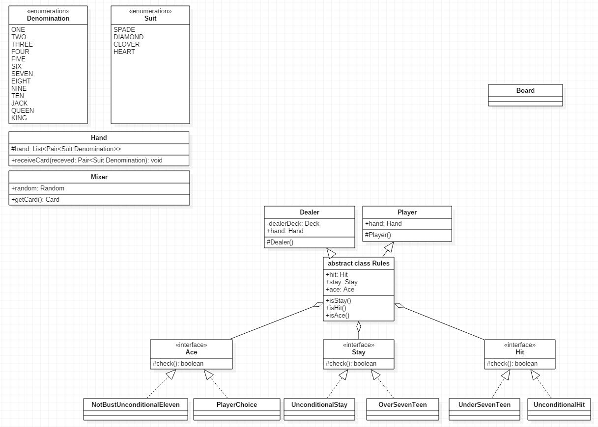

# 들어가며

- 업무에 Java를 사용하고 있지만, 깊은 이해도가 부족하다는걸 절감.
- 단순 객체 생성 및 비즈니스 로직 구현에만 매달리고 있음. 회의감이 듦.
- 신규 개발 뿐만 아니라 유지 보수 및 리팩토링시 객체 지향의 묘미를 살려보고자 함
- 객체 지향적 시야와 사고는 연습뿐이라는 것을 여러 커뮤니티에서 수집
- 객체 지향 설계 연습을 통해 객체 지향적 시야와 이해력을 높이고지 함

# 이제부터 [객체 지향 생활 체조](https://jungha-cho.github.io/2018/03/30/%EA%B0%9D%EC%B2%B4-%EC%A7%80%ED%96%A5-%EC%97%B0%EC%8A%B5-%ED%95%98%EA%B8%B0-%ED%94%84%EB%A1%9C%EC%A0%9D%ED%8A%B8/)를 준수하겠습니다.

# 요구 사항 분석 v2

- 요구 사항은 지속적으로 수정한다.

| 구분              | 내용                                                                                                                              |
| ----------------- | --------------------------------------------------------------------------------------------------------------------------------- |
| 저자              | 조정하                                                                                                                            |
| 시나리오          | 유저는 게임을 키면 딜러의 플레이 설명을 본뒤, 게임 스타트를 하면 카드 2장을 나눠 받는다.                                          |
|                   | 유저는 나눠 받은 2장과 딜러의 2장 카드를 보며 Hit와 Stay를 선택하며, 블랙잭 게임 룰에따라 끝날때까지 게임을 진행한다.             |
|                   | 초반 코인은 1,000원으로 진행하며 돈이 없어질때까지 또는 게임을 포기할때 까지 블랙잭 게임은 계속된다.                              |
| 회피목표          | 실제 블랙잭 모델은 딜러 1명과 7명의 유저까지 게임 플레이가 가능하지만, 현재 V2는 딜러 1명과 유저 1명이 게임 진행 가능하게 만든다. |
|                   | V2 버전에서는 세부 규칙 외 기본 딜러 규칙과 기본 유저 규칙만 적용한다.                                                            |
| 세부사항1         | 코드는 객체 지향 생활 체조를 준수 한다.                                                                                           |
|                   | 클래스 다이어그램을 상세하게 다시 작성해야 한다.                                                                                  |
| 딜러 세부사항     | 딜러는 카드의 합이 16이하면 무조건 HIT, 17이상이면 무조건 STAY                                                                    |
|                   | 딜러는 초기 카드 2장 중 카드 한장을 항상 가려두고 나머지만 오픈한다                                                               |
| 플레이어 세부사항 | 플레이어는 딜러의 카드 합이 16이하이면 무조건 HIT한다                                                                             |
| 미해결 문제       | 유저의 세부 규칙이 미적용 되어 있다. 스플릿, 더블다운, 인셔런스, 푸시, 이븐머니, 서렌더 등                                        |

# UML

- 객체 지향과 디자인 패턴에만 너무 빠져, 과유 불급인것 같아 불필요한 부분은 솎아냈습니다.
- Rule 부분을 STRATEGY 패턴으로 묶어 적용 중입니다.
- Rule은 딜러와 플레이어가 적용 받는 규칙이 다르며, 해당 규칙은 특정 행동으로 묶여있습니다.
- 현재까지 ACE 카드 룰과 STAY, HIT 룰을 적용했습니다.
- [객체 지향 생활 체조](https://jungha-cho.github.io/2018/03/30/%EA%B0%9D%EC%B2%B4-%EC%A7%80%ED%96%A5-%EC%97%B0%EC%8A%B5-%ED%95%98%EA%B8%B0-%ED%94%84%EB%A1%9C%EC%A0%9D%ED%8A%B8/)를 준수하려고 했지만, 마음대로 되지가 않습니다.
- 조금더 나은 UML이 될때까지 수정 수정 수정, 블랙잭 V2 버전 코드는 설계 후에 진행하겠습니다.

# Reference

> - 
