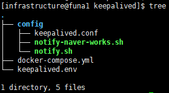

# 이미지

- https://github.com/shawly/docker-keepalived
- keepalived 최신 버전까지 도커라이징 됨

# 폴더 구조



# docker-compose.yml

```docker
services:
  keepalived:
    image: shawly/keepalived:${SHAWLY_KEEPALIVED_VERSION}
    container_name: keepalived
    restart: unless-stopped
    network_mode: host
    volumes:
      - ./config:/etc/keepalived:ro
    cap_add:
      - NET_ADMIN
      - NET_BROADCAST
    env_file: keepalived.env
```

# .env

- docker compose 파일 자체 환경 변수 설정 파일

```docker
SHAWLY_KEEPALIVED_VERSION=2.3.1
```

# keepalived.env

- docker container 내 환경 변수 설정 파일

```docker
# for keepalived containers
TZ=Asia/Seoul
KEEPALIVED_CUSTOM_CONFIG=true

# for naver works alarm
NOTIFICATION_HEADER={헤드라인}
NOTIFICATION_ADVERTISEMENT_HOSTNAME={호스트네임}
NOTIFICATION_BOT_ID={자체 봇 아이디}
NOTIFICATION_BOT_URL={자체 봇 알람 URL}
NOTIFICATION_BOT_TOKEN={자체 봇 알람용 공용 토큰}
```

# keepalived.conf

- MASTER가 다운되었다가 회복되었을때 MASTER 권한을 되찾고 싶다면 PREEMPT 세팅
    - MASTER 노드만 state MASTER 로 설정
- MASTER가 다운된 후 회복되더라도 현재 구성을 유지하고 싶으면 NOPREEMPT 세팅
    - MASTER 노드 포함 모든 노드 state BACKUP 구성
- priorty는 값이 큰 게 우선순위가 높음

```docker
global_defs {
  router_id funa1
}

vrrp_sync_group VG1 {
  group {
    VI1
  }
}

vrrp_instance VI1 {
  interface eno1
  #state MASTER # FOR PREEMPT
  state BACKUP # FOR NOPREEMPT
  advert_int 1 # advertisement interval seconds
  virtual_router_id 1
  priority 200
  nopreempt

  authentication {
    auth_type PASS
    auth_pass 7RynEPUTqh3n7y5%nLcZ
  }

  virtual_ipaddress {
    218.234.206.70/26
  }

  notify "/etc/keepalived/notify.sh"
}
```

# notify.sh

- keepalived 모듈이 해당 스크립트 실행을 위해서 실행 권한이 필요
    - chmod +x notify.sh

```docker
#!/bin/bash

TYPE=$1
NAME=$2
STATE=$3
PRIORITY=$4

case $STATE in
    "BACKUP") # Perform action for transition to BACKUP state
	      bash /etc/keepalived/notify-naver-works.sh $1 $2 $3 $4 "Perform action for transition to BACKUP state"
              exit 0
              ;;
    "FAULT")  # Perform action for transition to FAULT state
	      bash /etc/keepalived/notify-naver-works.sh $1 $2 $3 $4 "Perform action for transition to FAULT state"
              exit 0
              ;;
    "MASTER") # Perform action for transition to MASTER state
	      bash /etc/keepalived/notify-naver-works.sh $1 $2 $3 $4 "Perform action for transition to MASTER state"
              exit 0
              ;;
    *)        echo "Unknown state ${STATE} for VRRP ${TYPE} ${NAME}"
	      bash /etc/keepalived/notify-naver-works.sh $1 $2 $3 $4 "Unknown state $STATE for VRRP $TYPE $NAME"
              exit 1
              ;;
esac
```

# notify-naver-works.sh

- keepalived 모듈이 해당 스크립트 실행을 위해서 실행 권한이 필요
    - chmod +x notify.sh

```docker
#!/bin/bash

TYPE=$1
NAME=$2
STATE=$3
PRIORITY=$4
MESSAGE=$5

curl \
	--request POST \
	--header "Content-Type: application/json" \
	--header "Authorization: Bearer $NOTIFICATION_BOT_TOKEN" \
	--data "{\"content\": {\"type\": \"text\", \"text\": \"$NOTIFICATION_HEADER\r\n\r\nkeepalived state change notification\r\n\r\n- HOSTNAME: $NOTIFICATION_ADVERTISEMENT_HOSTNAME\r\n- NAME: $NAME\r\n- STATE: $STATE\r\n- TYPE: $TYPE\r\n- PRIORITY: $PRIORITY\r\n- MESSAGE: $MESSAGE\"}}" \
	${NOTIFICATION_BOT_URL}
```