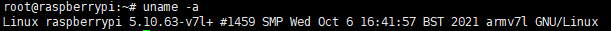
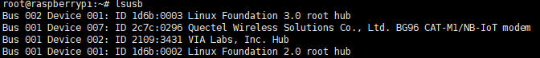
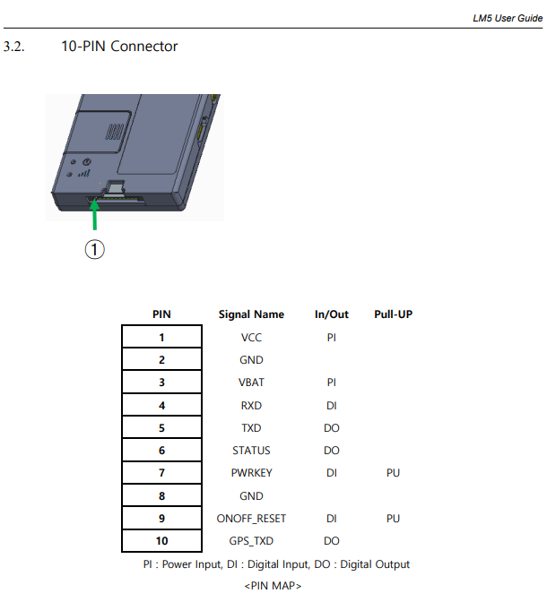
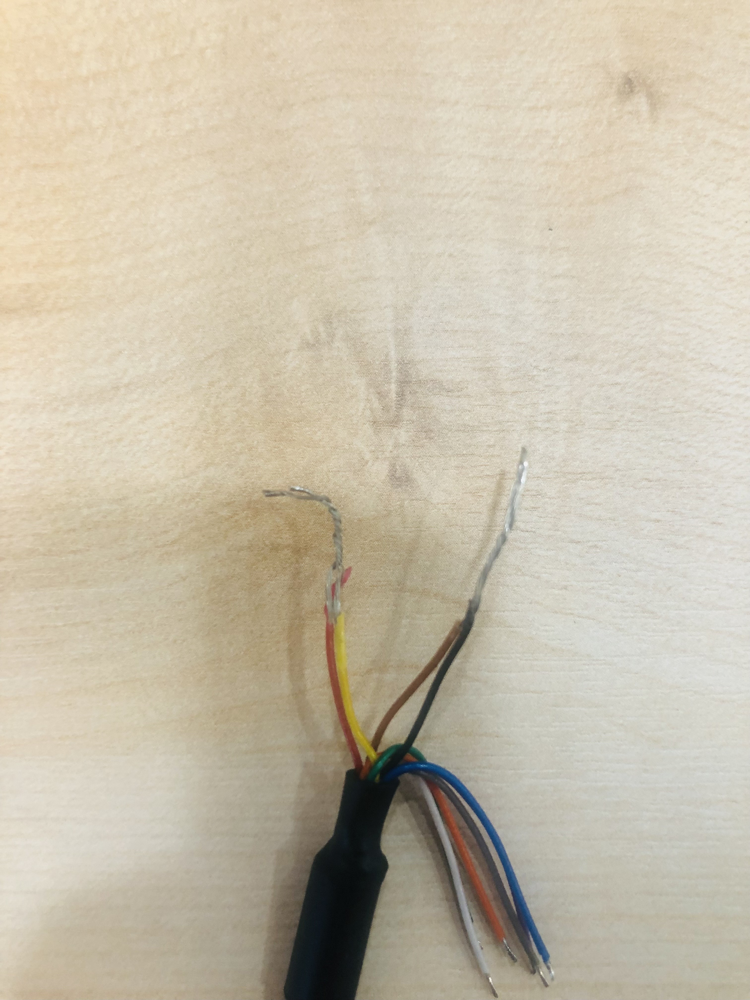

# Hardware Spec

## System

- Raspberry Pi 4B
- 패키지 최신버전

```shell
 apt-get update && apt-get upgrade
```



## Modem

- LTE-M1 모뎀 사용
- 통신 칩 모델은 Quectel BG96 CAT-M1
- cat-m1 키워드로 검색시 레퍼런스 다수 존재

### 연동 과정

1. Raspberry Pi 4B - Raspbian OS 최신 버전 설치
2. Raspbian OS 패키지 업데이트
3. Raspberry Pi 4B - USB 3번 포트에 LM5 USB로 연결

- LM5는 USB에서 전원을 입력받을 수 있으므로 통신과 전원 둘다 공급 받음

4. USB 드라이버 설치 없이 연결 확인 됨



1. picocom 터미널로 usb에 접근

- picocom -b 115200 /dev/ttyUSB2

2. at 커맨드로 통신사 연결 확인

> 추후 사용될 프로그래밍 언어에 맞춰서 터미널 라이브러리 또는 AT 커맨드 라이브러리를 찾아 활용해야 할듯.

3. 예제

- [https://asciinema.org/a/DVxikcP7q3JoEC7fYzK1jUPWF](https://asciinema.org/a/DVxikcP7q3JoEC7fYzK1jUPWF)

## LM5, AT COMMAND 매뉴얼

- [Quectel_BG96_GNSS_AT_Commands_Manual_V1.1.pdf](Quectel_BG96_GNSS_AT_Commands_Manual_V1.1.pdf)

- [Quectel_BG96_HTTP(S)_AT_Commands_Manual_V1.0.pdf](Quectel_BG96_HTTP(S)_AT_Commands_Manual_V1.0.pdf)

- [Quectel_BG96_MQTT_Application_Note_V1.0.pdf](Quectel_BG96_MQTT_Application_Note_V1.0.pdf)

- [Quectel_BG96_TCP(IP)_AT_Commands_Manual_V1.0.pdf](Quectel_BG96_TCP(IP)_AT_Commands_Manual_V1.0.pdf)

- [Wireless_LTE_CAT-M1_Module_Modem SW Manual_Rev1.9.pdf](Wireless_LTE_CAT-M1_Module_Modem_SW_Manual_Rev1.9.pdf)

- [LM5 User Guide V2.6.pdf](LM5_User_Guide_V2.6.pdf)

- [Quectel_BG96_AT_Commands_Manual_V2.3.pdf](Quectel_BG96_AT_Commands_Manual_V2.3.pdf)

## 추가

- TCP 예제

### 1. OPEN

```
- AT+QIOPEN=<contextID>,<connectID>,<service_type>,<IP_address>/<domain_name>,<remote_port>[,<local_port>[,<access_mode>]]
- at+qiopen=1,0,"TCP","59.25.177.53",19999,0,0
```

### 1.1. OPEN 실패시

```
- qi+deact=1
```

### 2. STATE

```
- at+qistate?
```

### 3. SEND

```
- AT+QISEND=<connectID>
- AT+QISEND=<connectID>,<send_length>
- AT+QISEND=<connectID>,<send_length>,<remoteIP>,<remote_port>
- AT+QISEND=<connectID>,0
```

### 4. RECV

- open access mode를 buffer 모드로 선택했을 경우
- at+qird=0

- [https://asciinema.org/a/BMMrprwy93tD7DjQxBsuI2WOx](https://asciinema.org/a/BMMrprwy93tD7DjQxBsuI2WOx)

- [https://github.com/Wiznet/wiznet-iot-shield-mbed-kr/blob/master/docs/mbed_guide_bg96_tcp.md](https://github.com/Wiznet/wiznet-iot-shield-mbed-kr/blob/master/docs/mbed_guide_bg96_tcp.md)

## 추가 2

전원 인가시 LM5 모듈 자동 ON






## 추가 3

### Golang Connect To LM5 CAT.M1 Example

- Golang에서 Arm 아키텍처 컴파일을 지원함
- https://github.com/tarm/goserial 사용
    - 단순 INPUT, OUTPUT 입출력 기능만 제공함
    - 6년전이 마지막 업데이트 라이브러리
    - 더 최신의 LIBRARY에 더 많은 유틸 기능을 제공할 가능성이 있음

```go
package main

import (
	"bufio"
	"context"
	"fmt"
	"github.com/sirupsen/logrus"
	"github.com/tarm/goserial"
	"io"
	"log"
	"os"
	"os/signal"
	"strings"
	"sync"
	"syscall"
)

func main() {
	ctx, cancel := context.WithCancel(context.Background())
	wg := sync.WaitGroup{}

	ttyUsb2 := &serial.Config{
		Name: "/dev/ttyUSB2",
		Baud: 115200,
		//ReadTimeout: 0,
	}

	port, err := serial.OpenPort(ttyUsb2)
	if err != nil {
		panic(err)
	}

	go func() {
		wg.Add(1)
		defer wg.Done()
		inputReader := bufio.NewReader(os.Stdin)
		for {
			select {
			case <-ctx.Done():
				return
			default:
				in, err := inputReader.ReadString('\n')
				if err != nil {
					fmt.Printf("incomming error: %v", err)
				}
				//incoming <- o
				_, err = port.Write([]byte(strings.TrimRight(in, "\n") + "\r"))
				if err != nil {
					log.Printf("port.Write: %v", err)
				}
				//log.Printf("Written[%v]:[%v]\r\n", n, strings.TrimRight(in, "\n") + "\r")
			}
		}
	}()

	readCount := 0
	go func() {
		wg.Add(1)
		defer wg.Done()

		for {
			select {
			case <-ctx.Done():
				return
			default:
				buf := make([]byte, 512)
				n, err := port.Read(buf)
				if err != nil && err != io.EOF {
					log.Printf("port.Read: %v", err)
				}
				//fmt.Println("READ: ", string(buf))
				//fmt.Printf("READ[%v]:%s \r\nBYTES: % 02x\r\n", n, buf[:n], buf[:n])
				if n > 0 {
					readCount = readCount + 1
					//fmt.Println("---------------")
					//fmt.Printf("READ[%v][%v]: %s", n, readCount, buf[:n])
					fmt.Printf("%s\r\n", buf[:n])
				}
			}
		}
	}()

	sc := make(chan os.Signal, 1)
	signal.Notify(
		sc,
		//syscall.SIGHUP,  // kill -SIGHUP
		syscall.SIGINT,  // kill -SIGINT Ctrl+c
		syscall.SIGKILL, // kill -SIGQUIT
		syscall.SIGTERM, // kill -TERM
	)

	sig := <-sc
	cancel()
	if err = port.Close(); err != nil {
		fmt.Println(err)
	}
	logrus.WithFields(logrus.Fields{
		"signal": sig.String(),
	}).Info("terminated called")
	//wg.Wait()
	logrus.WithFields(logrus.Fields{
		"signal": sig.String(),
	}).Info("terminated done")

}
```

### HTTP POST, GET 예제

- [https://asciinema.org/a/HSOtYQ4cMeDcjbgZ4sCCpYSDH](https://asciinema.org/a/HSOtYQ4cMeDcjbgZ4sCCpYSDH)

```
AT+CMEE=2   --------- 에러 출력
AT+CPIN?      --------- 사용 준비 여부
AT+COPS?     --------- 통신사 정보
AT+CNUM     --------- 등록된 번호
AT+QCDS      --------- 등록 세부 정보
AT+CFUN=1,1 --------- 재시작

---- AT+QICSGP=1,3,"","","",0
---- 모뎀 출고시 기본 설정으로 사용 가능하나 네트워크 등록이 안될때 사용

---- AT+QHTTPCFG=“contextid”,1
---- 가이드에는 컨텍스트ID 설정하라고 나와있으나 기본값이 1이라 생략 가능

AT+QIACT?
----- ERROR 또는 0일경우
----- AT+QIACT=1
----- AT+QIACT?

AT+QHTTPURL=25,80
----- AT+QHTTPURL=<url size>, <timeout second>
CONNECT
http://39.116.31.104/logs
OK

########################################## POST
AT+QHTTPPOST=63,80,80
----- AT+QHTTPPOST=<data_length>[,<input_time>,<rsptime>]
CONNECT
11234512345123111111222223331111111199.99099.99099.991234512345
OK

+QHTTPPOST: 0,200
------ 200 성공, 200 이외 실패

AT+QHTTPREAD=80
----- AT+QHTTPREAD=<wait_time>
CONNECT
Success
OK

+QHTTPREAD: 0

########################################## POST

########################################## GET
at+qhttpget=60

OK

+QHTTPGET: 0,200,396

at+qhttpread=60
at+qhttpread=60

CONNECT

Hostname: 12fbae9844cd
IP: 127.0.0.1
IP: 10.0.2.3
IP: 172.18.0.3
RemoteAddr: 10.0.2.80:52514
GET / HTTP/1.1
Host: whoami.swarm.
nanoit.kr:443
User-Agent: QUECTEL_MODULE
Accept: */*
Accept-Encoding: gzip
X-Forwarded-For: 110.70.29.242
X-Forwarded-Host: whoami.swarm.nanoit.kr:443
X-Forwarded-Port: 443
X-Forwarded-Proto: https
X-Forwarded-Server: bc52b9657c35
X-Real-Ip: 110.70.29.242

OK

+QHTTPREAD: 0
########################################## GET
```