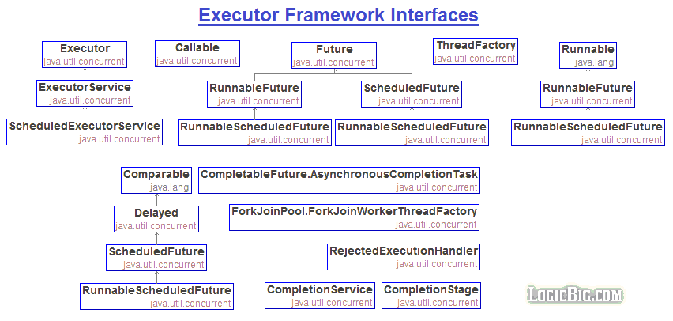
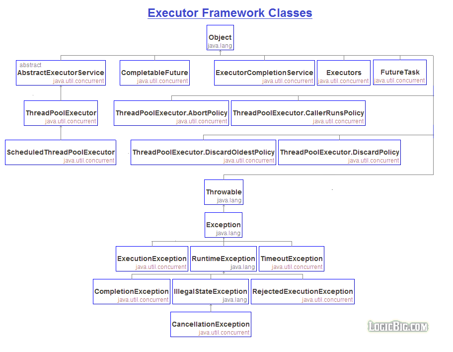

### Executor란?

Thread, Runnable, asyncTask만 쓰면서 병렬 프로그래밍을 한다!! 외차다가 조금 더 효율적이고 효과적인 방법들을 찾아나섰다. 와중에 Executor FrameWork를 이용해서 스레드 프레임을 짜볼려서 공부중인데, Callable, Future, Callback 등등 쓰는법 사용하는법 다 알겠다. 다 알겠는데 대체 Executor라는 놈이 뭘까? 라는 생각이 들어서 파헤쳐 보기로 했다.

사전적 뜻 부터 찾아보자.

- Executor : 실행 하는 놈, 집행자, 실행자라고 보면 된다.
- Callable : 여러 뜻이 있겠지만 단편적으로 부를수 있다. 라고 생각하자
- Callback : 비동기 관점에서, A가 B를 불렀는데 B가 없다. A는 자기 할일을 하는데 B가 오니까 누가 알려주는거.
- Future : 미래의 값을 받아볼수 있다? - Thread의 결과값을 받아볼 수 있게 해주는 클래스라고 생각하자.

### 더 파보자



- Executor Frame Workd 전체 Interface 구성도 이다.
- 괜히 봤다.
- 더 모르겠다.

- 각설하고 Interface 내에서도 상속 관계가 이어지는 모습을 봤을때 부모가 중요한 것 같다.
- Executor, Callable, Future, Runnable 등 Prefix, Postfix에 붙는걸 보았을때 나머지 이름이 해당 인터페이스와 이를 상속받는 클래스들이 하는 일들을 정리해 줄것이다.

### 이글의 핵심인 Executor를 또 더 파보자



- Javadoc에서는 Executor를 Runnable이나 Thread를 실행시켜주는 `집행자`라고 정의하고 있다.

```java
//for each of a set of tasks, you might use:
Thread(new(RunnableTask())).start()

//각각 태스크를 직접 실행하는 대신에
//Executor에게 실행하라고 태스크를 넘겨주라고 한다.
Executor executor = anExecutor;
executor.execute(new RunnableTask1());
executor.execute(new RunnableTask2());
```

```java
// Executor를 구현해서
// 유일한 메소드인 execute로 실행해도 된다.
class DirectExecutor implements Executor {
  public void execute(Runnable r) {
    r.run();
  }
}
```

```java
// 또는 이런식으로 execute안에서도
class ThreadPerTaskExecutor implements Executor {
  public void execute(Runnable r) {
    new Thread(r).start();
  }
}
```

```java
// 또는 이렇게 내가 작업하고 싶은 작업 내용들을
// 비동기적으로...
// 이게 뭐지!?
class SerialExecutor implements Executor {

  final Queue<Runnable> tasks = new ArrayDeque<Runnable>();
  final Executor executor;
  Runnable active;

  SerialExecutor(Executor executor) {
    this.executor = executor;
  }

  public synchronized void execute(final Runnable r) {
    tasks.offer(new Runnable() {
      public void run() {
        try {
          r.run();
        } finally {
          scheduleNext();
        }
      }
    });
    if (active == null) {
      scheduleNext();
    }
  }

  protected synchronized void scheduleNext() {
    if ((active = tasks.poll()) != null) {
      executor.execute(active);
    }
  }
}
```

- 하아.. 그러니까 어디보자..
- Executor는 비동기 실행자이다.
- task를 할당하는 순서대로 보장받지 못한다.
- 그래서 SerialExecutor로 구현하면 Executor를 이용해서 순서를 보장받을 수 있다.
- 음... 왜 이래야 할까요..?

### 봐도 봐도 Executor의 존재 이유를 모르겠다.

- 얼핏, 비동기 실행을 위한 분리 구현?
- 음...

### 붙잡고 있지 말고 ExecutorService로 가보자

- 하나 이상의 비동기 태스크 추적을 위한 Future를 생성할 수 있는 Executor......
- 음.. 구조적이고 체계적인 그러니까...
- Executor는 Task와 Thread를 분리하고, Thread에 Task를 할당해서 비동기적으로 실행이 가능하게 만들어 주는 거로구만...
- 음......................................

### 더 모르겠다. 코드를 보자!!

```java
ExecutorService es = Executors.newFixedThreadPool();
ExecutorService es = Executors.newCachedThreadPool();
ExecutorService es = Executors.newSingleThreadExecutor();
ExecutorService es = Executors.newScheduledThreadPool();
```

- ExecutorService는 위와같은 방법들로 생성이 가능하다.
- 각각의 Executors.\*(); 의 인자값에 적절한 값을 넣어주면 다음과 같은 특징으로 ExecutorService가 동작한다.

- 순서대로  
  // 초기 스레드 수 = 0, 코어 스레드 수 = n, 최대 스레드 수 = n  
  // 초기 스레드 수 = 0, 코어 스레드 수 = 0, 최대 스레드 수 = Integer.MAX_VALUE  
  // 단일 스레드, 작업 중 Exception 발생시 새로운 스레드 생성  
  // 특정 시간에 동작시킬 수 있는 스레드

- 각 인자값과 예제는 여러 IT 블로그들에서 찾아볼 수 있다.

```java
/**
 * Created by Administrator on 2017-05-10.
 *
 * @version : ver 1.0.0
 * @desc : cho_jeong_ha
 *
 * -- 작업의 실행과 종료
 *
 * -- ExecutorService 객체를 생성할때 쓰레드 풀 관리 방식과 스레드 갯수를 정할수 있다.
 *
 * newFixedThreadPool       : 초기 스레드 수 = 0, 코어 스레드 수 = n, 최대 스레드 수 = n
 * newCachedThreadPool      : 초기 스레드 수 = 0, 코어 스레드 수 = 0, 최대 스레드 수 = Integer.MAX_VALUE
 * newSingleThreadExecutor  : 단일 스레드, 작업 중 Exception 발생시 새로운 스레드 생성
 * newScheduledThreadPool   : 일정 시간에 동작시킬 수 있는 스레드
 *
 * -- 쓰레드의 종료
 * void shutdown()          : 현재 처리 중인 작업뿐만아니라 작업 큐에 대기하고 있는 모든 작업을 처리한 뒤에 스레드 풀을 종료시킨다.
 * List<Runnable>           : 현재 작업 처리 중인 스레드를 interrupt해서 작업 중지를 시도하고 스레드 풀을 종료시킨다.
 *                            리턴값은 작업 큐에 있는 미처리된 작업의 목록이다.
 * boolean awaitTermination(long timeout, TimeUnit unit)
 *                          : shutdown 메소드 호출 이후, 모든 작업 처리를 timeout 시간내에 완료하면 true를 리턴하고,
 *                            완료하지 못하면 작업 처리 중인 스레드를 interrupt하고 false를 리턴한다.
 **/
public class ExecutorServiceExample_1_ExcutorService {
  // No Parameter
  static ExecutorService es1 = Executors.newCachedThreadPool();

  // CPU 코어 수의 최대 쓰레드 생성
  static ExecutorService es2 =
      Executors.newFixedThreadPool(Runtime.getRuntime().availableProcessors());

  public static void mian(String[] args){
    // 스레드의 종료
    es1.shutdown();
    es1.shutdownNow();
    try {
      es2.awaitTermination(5, TimeUnit.MILLISECONDS);
    } catch (InterruptedException e) {
      e.printStackTrace();
    }
  }
}
```

- 공부하면서 만들어본 예제.
- 내일은 Callable과 Future를...
- 근데 아직도 Executor가 뭔지 잘 모르겠다..
