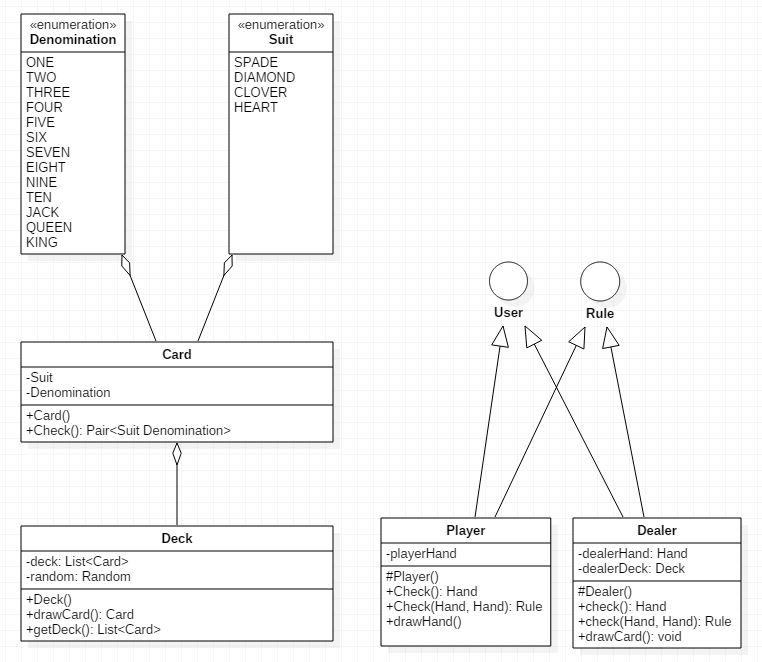

# 객체 지향 설계 연습하기 - 블랙잭 (5)

[github source code](https://github.com/JungHa-Cho/BlackJack)

### 0. 들어가며

- 업무에 Java를 사용하고 있지만, 깊은 이해도가 부족하다는걸 절감.
- 단순 객체 생성 및 비즈니스 로직 구현에만 매달리고 있음. 회의감이 듦.
- 신규 개발 뿐만 아니라 유지 보수 및 리팩토링시 객체 지향의 묘미를 살려보고자 함
- 객체 지향적 시야와 사고는 연습뿐이라는 것을 여러 커뮤니티에서 수집
- 객체 지향 설계 연습을 통해 객체 지향적 시야와 이해력을 높이고지 함

### 1. 또 다시 6일만에...

시간이 없기도 했지만, 뭔가 제대로 설계 및 구현 해보고 싶은 욕심에 진도가 더 이상 나가질 않는다.  
2018-03-26 시간으로 [헤드 퍼스트 디자인 패턴](https://github.com/JungHa-Cho/HeadFirstDesignPattern)을 Factory 까지 다시 끝냈으며, 현재까지 진도가 나간 부분을 바탕으로 블랙잭 구현에 적용해 보고자 한다.

### 2. 패턴 원칙, 지금까지 배운것들까지만.

`디자인 원칙 1 - 애플리케이션에서 달라지는 부분을 찾아내고, 달라지지 않는 부분으로 부터 분리 시킨다`  
`디자인 원칙 1 - 애플리케이션에서 달라지는 부분을 찾아내고, 달라지지 않는 부분으로부터 분리시킨다.`  
`디자인 원칙 2 - 구현이 아닌 인터페이스에 맞춰서 프로그래밍 한다.`  
`디자인 원칙 3 - 상속보다는 구성을 활용한다.`  
`디자인 원칙 4 - 서로 상호작용 하는 객체 사이에서는 가능하면 느슨하게 결합하는 디자인을 사용해야 한다.`  
`디자인 원칙 5 - 추상화된 것에 의존하도록 만들어라. 구상 클래스에 의존하도록 만들지 않도록 한다.`

말은 쉽지... 처음이 다 어렵겠지만, 지금 더더욱더 어렵게 느껴지는것 같다.  
몇일간 블랙잭 프로젝트를 조금 더 다듬어 보고자 패턴 책을 다시 읽었지만, 바뀌는건 없는것 같다.  
무엇인가 큰 그림이 그려지지 않는것 같아서 UML을 그려 보았다.

### 3. UML

> UML은 전혀 사용해보지 않은 사람으로써, 학부때 맛만 봤다는 것을 알린다... 따라서 아래 UML은 전혀 사실과 다를 수도 있다.

> 이제 이 UML을 바탕으로 블랙잭 프로젝트에서 객체 지향을 적용해보며 가지고 놀 생각이다.
> 지금은 엉망이지만, 앞으로 업데이트될 도식과 블랙잭 프로젝트를 기대하며.. 잠이와서.. 그만..
> 전체적인 개발 능력의 깊이를 숙성시키기 위한 프로젝트는 계속된다.

## Reference

> - [UML](http://geniusduck.tistory.com/entry/UML-%EA%B8%B0%EB%B3%B8%ED%8E%B8-%EA%B8%B0%EB%B3%B8-%ED%91%9C%EA%B8%B0-%ED%98%95%EC%8B%9D-%EB%B0%8F-%EA%B4%80%EA%B3%84%ED%91%9C%ED%98%84%EB%B2%95)
